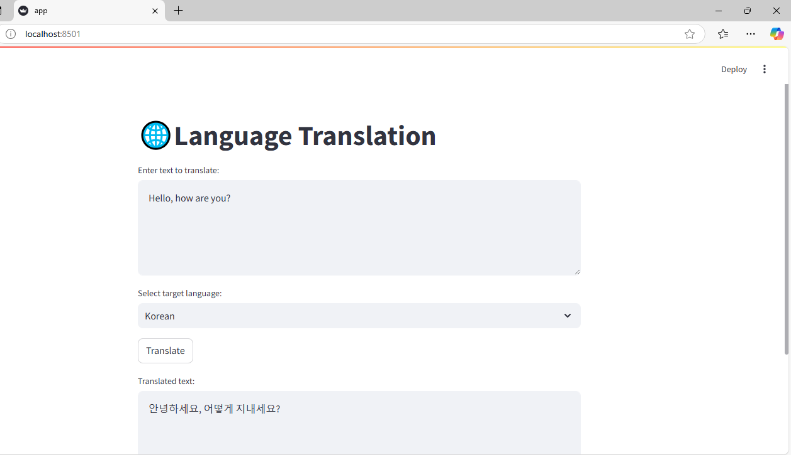

# 🌐 Language Translation 

This project is a **language translation application** built using **FastAPI** (backend) and **Streamlit** (frontend). It leverages **Facebook's MBART model** for translation and stores results in **MongoDB** to avoid redundant translations.

---

## 🚀 Features
- Translate text from **English** to **Hindi** or **Korean**.
- Uses **Facebook MBART** (`facebook/mbart-large-50-many-to-many-mmt`).
- Caches translations in **MongoDB** for efficiency.
- Simple **Streamlit UI** for easy interaction.
- **FastAPI** handles requests efficiently.

---

## 🛠️ Prerequisites

Before setting up the project, ensure you have the following installed:

- Python 3.x (ideally 3.8+)
- MongoDB (running locally or in a remote instance)
- FastAPI (for the backend API)
- Streamlit (for the frontend interface)
- Pydantic, Hugging Face Transformers, and requests (for model loading, tokenization, and API calls)
- SentencePiece (installed automatically if missing)

---

## Create and Activate a Virtual Environment(for windows)

    ```bash
    python -m venv venv
    venv\Scripts\activate
    ```

#### 🔧 Install Dependencies 
- Create a **requirements.txt** file,Ensure the  file contains the following dependencies:

- **`fastapi`**: Web framework for building APIs.
- **`uvicorn`**: ASGI server to serve FastAPI.
- **`transformers`**: Hugging Face library for NLP models.
- **`pydantic`**: Data validation for FastAPI requests.
- **`torch`**: Deep learning framework for running ML models.
- **`sentencepiece`**: Tokenizer used in NLP models.
- **`streamlit`**: Frontend framework for creating web apps.
- **`pymongo`**: MongoDB client for database interaction.

- run this to install all the libraries stored in **requirements.txt** file
```bash
pip install -r requirements.txt
```

## Setting Up MongoDB

### Step 1: Install MongoDB

#### On Windows:
1. Download the MongoDB installer from the [MongoDB website](https://www.mongodb.com/try/download/community).
   
2. Run the downloaded installer (`.msi` file) and follow the installation prompts. Make sure to choose the following options during the installation process:
   - **Install MongoDB as a Service**: This will allow MongoDB to start automatically in the background when your computer boots up.
   - **Select the "Complete" option** for the installation type, ensuring all necessary components are installed.

3. After the installation is complete, MongoDB should automatically start as a background service on your system.

4. You can confirm that MongoDB is running by opening the Command Prompt and typing the following command:
   ```bash
   mongo

### Step 2: Create MongoDB Database and Collection

1. **You don’t need to manually create the database or collection** because MongoDB will automatically create them for you the first time you insert a document. 

   When you run the FastAPI backend and the first translation request is made, MongoDB will automatically create the database (`translation_db`) and the collection (`translations`) if they don't already exist.

2. However, if you prefer to create the database and collection manually, you can do so by following these steps:

   - Open the MongoDB shell by running the following command:
     ```bash
     mongo
     ```
   
   - Switch to your desired database (in this case, `translation_db`):
     ```bash
     use translation_db
     ```
   
   - (Optional) Create the `translations` collection (MongoDB will automatically create this when data is inserted, but this step can be done manually if preferred):
     ```bash
     db.createCollection("translations")
     ```

   After this, your database and collection will be ready to store translation data.

## Run the project
#### To run the project:

1. Start MongoDB(command):``net start MongoDB``
2. Start FastAPI(command): ``uvicorn main:app --reload``
3. Start Streamlit(command): ``streamlit run app.py``

## Using the Application
- Open a web browser and go to http://localhost:8501.
- Enter the text you want to translate in the text box.
- Select the target language (Hindi or Korean) from the dropdown.
- Click the "Translate" button to get the translation.
- The translated text will be displayed below the input box.

## Future Enhancements
- **Support More Languages**: Add more languages to the translation pipeline.

### Images


